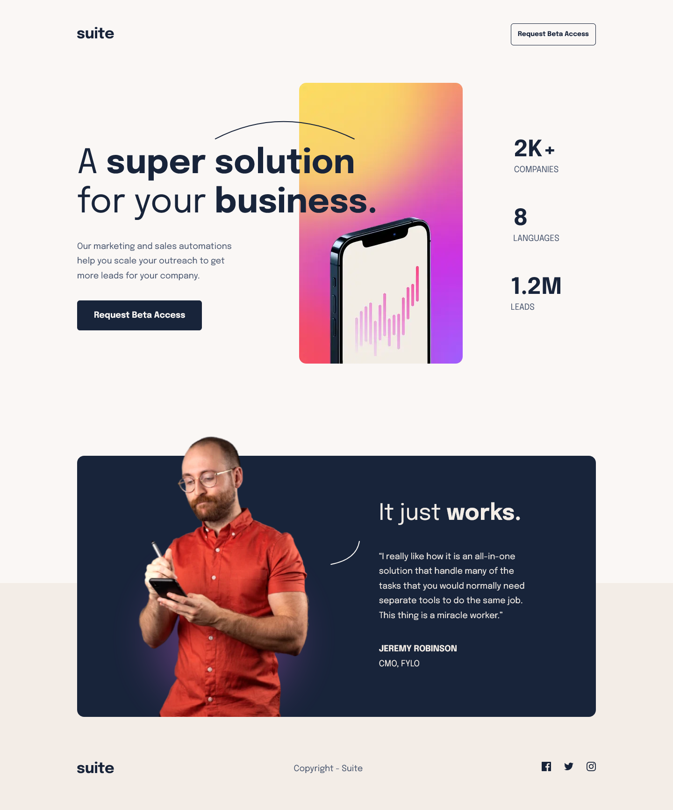

# Frontend Mentor - Suite landing page solution

This is a solution to the [Suite landing page challenge on Frontend Mentor](https://www.frontendmentor.io/challenges/suite-landing-page-tj_eaU-Ra). Frontend Mentor challenges help you improve your coding skills by building realistic projects.

## Table of contents

- [Overview](#overview)
  - [The challenge](#the-challenge)
  - [Screenshot](#screenshot)
  - [Links](#links)
- [My process](#my-process)
  - [Built with](#built-with)
  - [What I learned](#what-i-learned)
- [Author](#author)

## Overview

### The challenge

Users should be able to:

- View the optimal layout depending on their device's screen size
- See hover states for interactive elements

### Screenshot

### Links

- Solution URL: [Solution](https://www.frontendmentor.io/solutions/responsive-landing-page-using-css-grid-flexbox-and-bem-4CbK9wa5f)
- Live Site URL: [Live Site](https://abedfetrat.github.io/fem02-suite-landing-page/)

## My process

### Built with

- Semantic HTML5 markup
- CSS custom properties
- Flexbox
- CSS Grid
- Mobile-first workflow

### What I learned

- Using `<picture>` element to provide "webp" format images and "2X" images for higher DPI displays.

- Use CSS Grid to make layouts with overlapping elements.

## Author

- Frontend Mentor - [@abedfetrat](https://www.frontendmentor.io/profile/abedfetrat)
- Twitter - [@abedfetrat](https://www.twitter.com/abedfetrat)
- LinkedIn - [@abedfetrat](https://www.linkedin.com/in/abed-fetrat-84728717a/)
